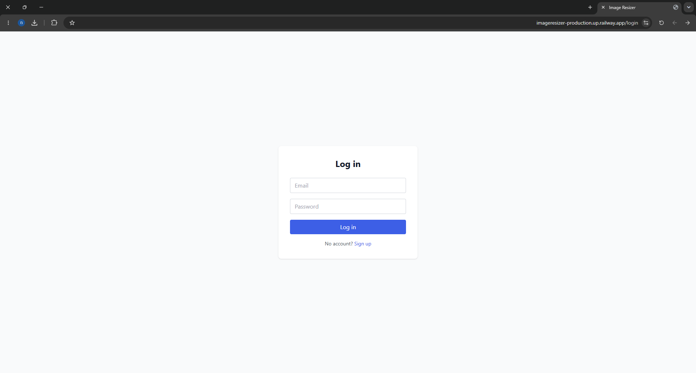
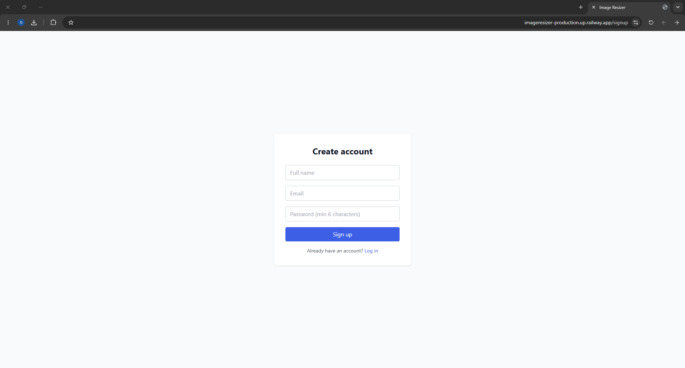
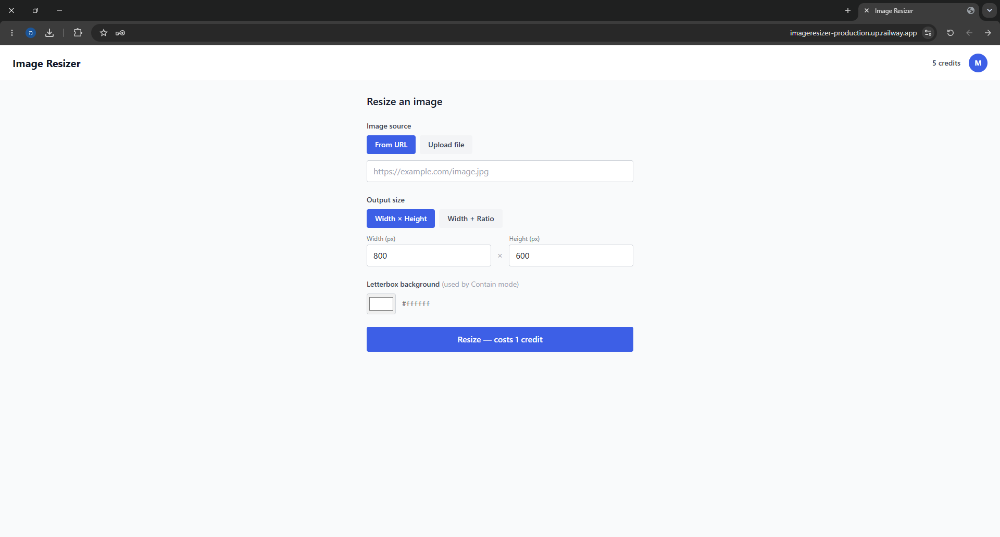
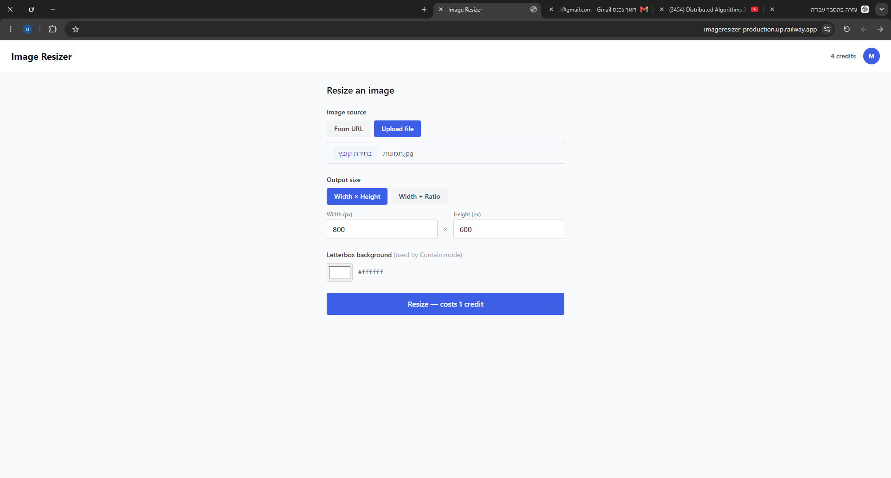
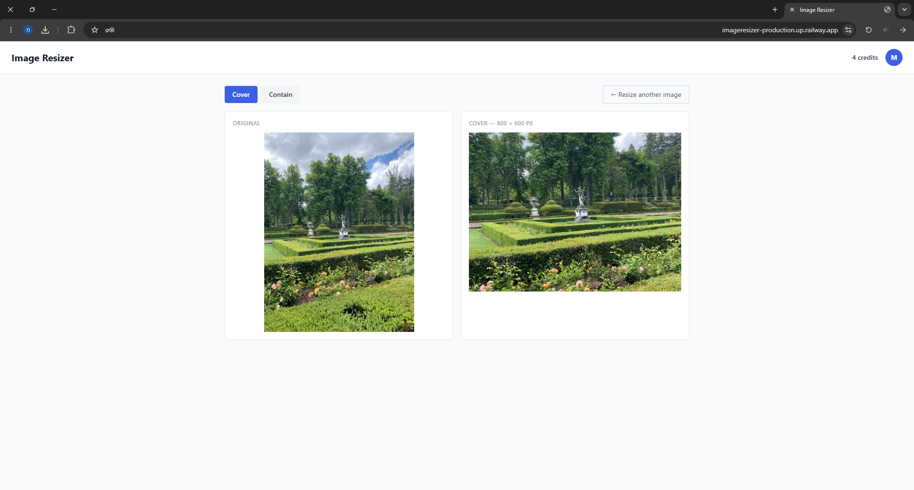
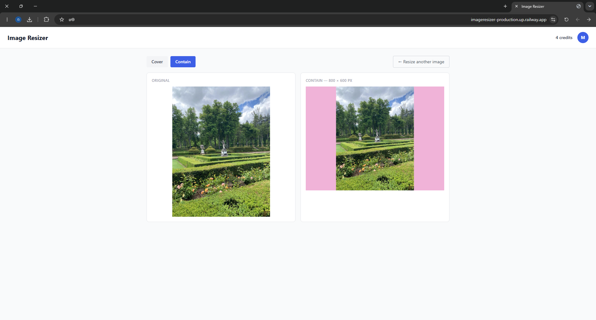
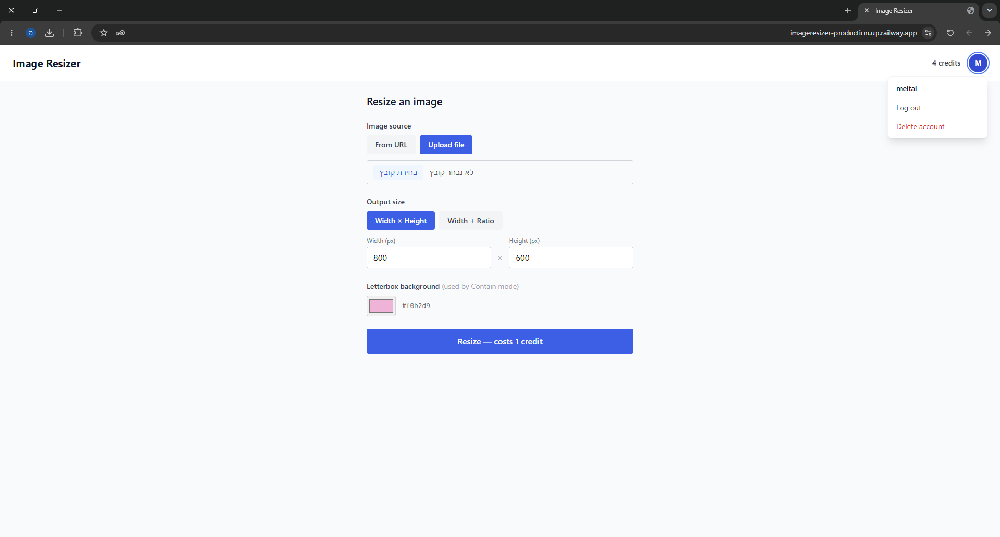

# Image Resizer

## Live Demo

The application is deployed and available online:

**https://imageresizer-production.up.railway.app**

No local installation is required for evaluation. The application can be tested directly through the live deployment.

---

## Project Overview

Image Resizer is a full-stack web application that allows users to:

- Create an account
- Log in securely
- Upload an image or provide an image URL
- Resize images using two different resizing strategies
- Compare the results side by side
- Manage credits
- Delete their account

The project was built using Next.js, MongoDB Atlas, Mongoose, Railway, and Sharp.

---

## Features

### User Management

- User registration
- User login
- Session-based authentication using iron-session
- Persistent login sessions
- Account deletion

### Image Processing

- Upload local image files
- Resize images from image URLs
- Support for custom dimensions
- Support for aspect-ratio-based resizing
- Background color selection for letterboxing
- Side-by-side comparison of resize strategies

### Credit System

- Users start with 5 credits
- Each resize operation consumes one credit
- Credits are updated atomically in MongoDB
- Low-credit warnings are displayed in the UI

### User Interface

- User avatar based on the first letter of the user's name
- Dropdown menu with user name, logout, and delete account
- Responsive and simple interface

---

## Technologies Used

### Frontend
- Next.js 14
- React
- TypeScript

### Backend
- Next.js API Routes
- Node.js

### Database
- MongoDB Atlas
- Mongoose

### Authentication
- iron-session

### Image Processing
- Sharp

### Deployment
- Railway

---

## Running Locally

### 1. Clone the repository

```bash
git clone <repository-url>
cd Image_Resizer
```

### 2. Install dependencies

```bash
npm install
```

### 3. Create a `.env.local` file

```env
MONGODB_URI=<your_mongodb_connection_string>
SESSION_SECRET=<your_session_secret>
```

### 4. Start the development server

```bash
npm run dev
```

### 5. Open the application

```text
http://localhost:3000
```

---

## Resize Strategy Tradeoff

### Cover

The image is resized so that it completely fills the target dimensions.

**Advantages**
- No empty space is visible.
- Produces visually consistent thumbnails.
- Useful for profile pictures and previews.

**Disadvantages**
- Parts of the image may be cropped.
- Important content near the edges can be lost.

### Contain

The entire image remains visible while fitting inside the target dimensions.

**Advantages**
- No image content is lost.
- Preserves the complete image.

**Disadvantages**
- May add padding (letterboxing).
- Does not completely fill the target area.

### Why Both Strategies Are Useful

Different use cases require different behavior.

Social media thumbnails often benefit from **Cover**, while product images and documents usually benefit from **Contain** because preserving all content is more important than filling the available space.

---

## Screenshots

### Login Page



### Registration Page



### Main Application



### Image Upload



### Resize Results




### Avatar Dropdown Menu



---

## Testing

The following functionality was manually tested:

### Authentication

- Registration
- Login
- Logout
- Session persistence after browser restart
- Account deletion

### Image Processing

- Resize from image URL
- Resize from uploaded file
- Cover strategy
- Contain strategy
- Aspect ratio mode
- Explicit width/height mode

### Credit System

- Credit deduction
- Low-credit warning
- Zero-credit handling

### Deployment

- MongoDB Atlas connectivity
- Railway deployment
- Production authentication
- Production image resizing

---

## Bonus Features

### Automated Tests

- Jest was added to the project.
- `resizeImage` has unit tests covering the core resizing logic.
- Amazon URL helper functions have unit tests.
- Run all tests with:

```bash
npm test
```

### Validation / Error Handling / UI Polish

- Improved input validation for signup, login, and resize forms.
- Friendly error messages for invalid URLs, oversized remote images, timeout or network failures, and Amazon extraction failures.
- The UI now displays the selected filename when uploading a file, a download button for the resized result, and inline error messages.

### Amazon Product URL Support

- Users can paste an Amazon product page URL instead of a direct image URL.
- The app extracts the ASIN from URLs of the form `/dp/B003TG75EG` and builds an Amazon image CDN URL automatically.
- If no ASIN is found, it falls back to best-effort HTML parsing to locate a product image.
- This approach avoids most Amazon hotlink-blocking issues.

 when an Amazon product page URL is used, the resized output is produced correctly, but the "Original" preview panel may not display the product image. This happens because the client still holds the original Amazon product page URL, not the resolved image URL.

---

## Example URLs for Testing

### Amazon Product URL

```
https://www.amazon.com/dp/B003TG75EG
```

### Direct Image URLs

```
https://upload.wikimedia.org/wikipedia/commons/4/47/PNG_transparency_demonstration_1.png
```

```
https://images.unsplash.com/photo-1506744038136-46273834b3fb?w=1200
```
---

## Future Improvements

- Fix the Amazon original preview: currently, when a user pastes an Amazon product page URL, the resized image is produced correctly, but the "Original" preview still shows the Amazon product page URL rather than the resolved image. The fix would be to have the API return the resolved image URL and use it in the frontend for the original preview.
- Add image history.
- Add support for more image formats and output options.

---

## Author

**Meital Basael**
